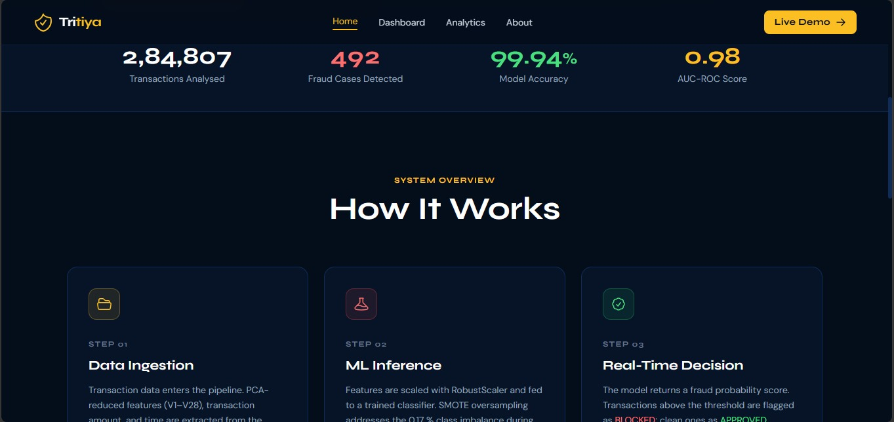
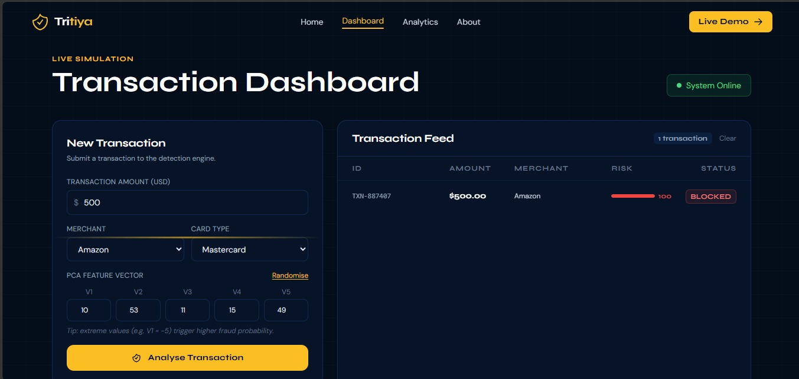
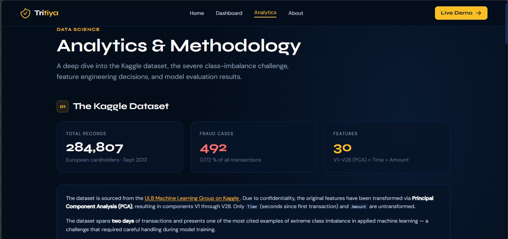
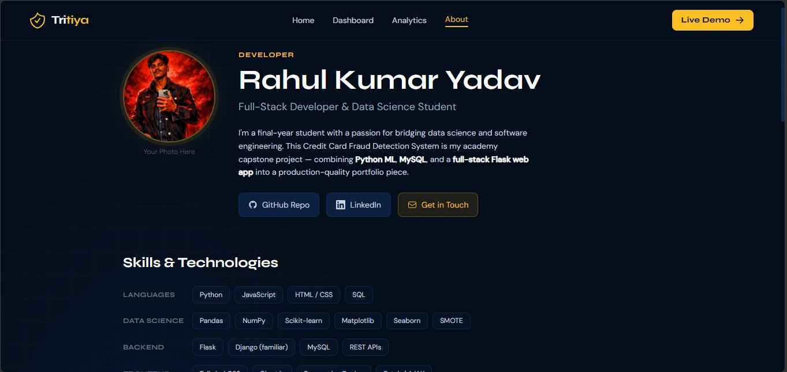
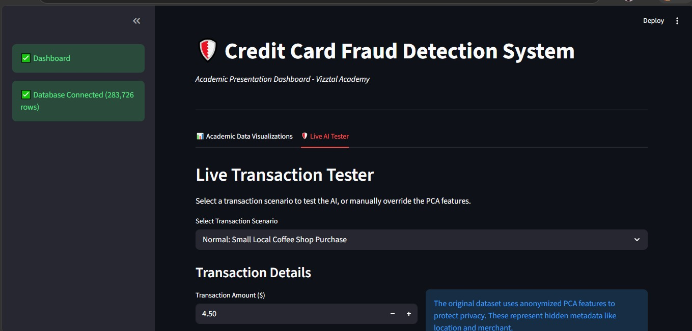
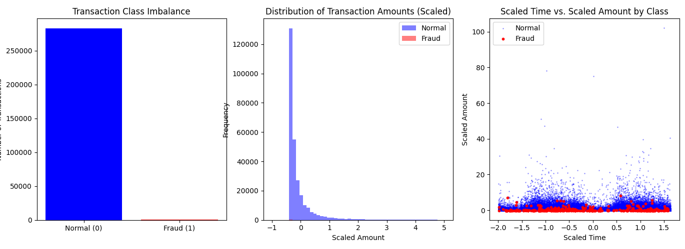

# Tritiya — Credit Card Fraud Detection System

A full-stack ML web application for your academy final project.

---

## 📁 Project Structure

```
fraud_detection/
├── app.py                  # Flask backend & API routes
├── requirements.txt        # Python dependencies
├── ml/
│   ├── fraud_model.pkl     # ← your trained model (add after training)
│   └── scaler.pkl          # ← your RobustScaler (add after training)
├── static/
│   └── img/                # ← drop your Matplotlib chart PNGs here
│       ├── amount_dist.png
│       ├── correlation.png
│       └── roc_curve.png
└── templates/
    ├── base.html           # Shared nav, footer, CSS variables
    ├── index.html          # Landing page
    ├── dashboard.html      # Live simulation dashboard
    ├── analytics.html      # Data science methodology
    └── about.html          # Developer portfolio
```

---

## 🚀 Quick Start

### 1. Install dependencies

```bash
pip install -r requirements.txt
```

### 2. Run the development server

```bash
python app.py
```

Open `http://localhost:5000` in your browser.

---

## 🔌 Connecting Your Real Model

In `app.py`, replace the `mock_predict()` stub with your actual model:

```python
import joblib

model  = joblib.load("ml/fraud_model.pkl")
scaler = joblib.load("ml/scaler.pkl")

def real_predict(amount, features):
    X = scaler.transform([[amount] + features])
    prob = model.predict_proba(X)[0][1]
    return {
        "fraud_probability": round(prob, 4),
        "is_fraud":          prob >= FRAUD_THRESHOLD,
        "risk_score":        int(prob * 100),
    }
```

Then call `real_predict()` inside the `/api/predict` route instead of `mock_predict()`.

---

## 🗄️ MySQL Integration

Add to `app.py` to log every flagged transaction:

```python
import mysql.connector

db = mysql.connector.connect(
    host="localhost", user="root",
    password="YOUR_PW", database="fraud_db"
)

def log_to_db(txn, prediction):
    cur = db.cursor()
    cur.execute("""
        INSERT INTO fraud_log
          (txn_id, amount, merchant, risk_score, is_fraud, timestamp)
        VALUES (%s, %s, %s, %s, %s, NOW())
    """, (txn["id"], txn["amount"], txn["merchant"],
          prediction["risk_score"], int(prediction["is_fraud"])))
    db.commit()
```

Call `log_to_db(data["transaction"], data["prediction"])` inside `/api/predict`.

---

## 📊 Embedding Matplotlib Charts

Export your EDA charts as PNG files and drop them in `static/img/`.
Then replace the placeholder `<div class="chart-placeholder">` in
`analytics.html` with:

```html

```

---

## 🎨 Customisation

| What to change          | Where                                            |
| ----------------------- | ------------------------------------------------ |
| Your name & bio         | `templates/about.html`                           |
| Headshot photo          | `static/img/headshot.jpg` + `about.html` img tag |
| GitHub / LinkedIn links | `templates/about.html` social links section      |
| Other projects          | `about.html` — duplicate the project card block  |
| Fraud threshold         | `FRAUD_THRESHOLD` constant in `app.py`           |
| Model metrics           | Stats hardcoded in `templates/analytics.html`    |

---

## 🌐 Deployment (Render / Railway / Heroku)

1. Add a `Procfile`: `web: gunicorn app:app`
2. `pip install gunicorn` → add to `requirements.txt`
3. Set `DEBUG=False` in `app.py` for production
4. Push to GitHub and connect to your platform of choice

# 🛡️ Credit Card Fraud Detection System

An end-to-end, decoupled machine learning pipeline and full-stack web application built to detect fraudulent financial transactions.

## 🏗️ System Architecture

This project utilizes a highly professional decoupled architecture separated into three distinct phases:

- [cite_start]**Data Engineering (Backend):** An ETL pipeline utilizing Python, Pandas, NumPy, and MySQL for secure data ingestion (processing batches of 10,000 rows to optimize memory)[cite: 767].
- [cite_start]**Machine Learning (The Brain):** Model training utilizing Scikit-Learn, comparing a Logistic Regression baseline against an advanced Random Forest Classifier[cite: 768].
- [cite_start]**Web Deployment (The Interface):** A dual-frontend approach featuring a Flask REST API, a Streamlit application for academic EDA presentation, and a custom Full-Stack dashboard using HTML, Tailwind CSS, and vanilla JS (with Chart.js) for public portfolio demonstration[cite: 770].

## 📸 Visual Project Showcase

## 📸 Visual Project Showcase

### 1. Custom Full-Stack Web Application ("Tritiya")

_A production-grade portfolio interface featuring real-time transaction simulation, database analytics, and an integrated developer profile._

**System Overview & Metrics**


**Live Transaction Dashboard**


**Data Science Analytics**


**Developer Profile**


---

### 2. Academic Presentation UI (Streamlit)

_An interactive dashboard designed for academic defense, allowing instructors to test the isolated Random Forest model using real-world scenarios._


---

### 3. Exploratory Data Analysis (EDA)

_Backend-generated Matplotlib visualizations highlighting the severe 0.17% class imbalance and feature distributions._


## 📊 Dataset & Modeling

[cite_start]The system was trained on the highly imbalanced Kaggle ULB Credit Card Fraud dataset, which contains 284,807 total transactions but only 492 actual frauds[cite: 766].

Because raw accuracy is a misleading metric for severely imbalanced data, the models were evaluated heavily on Precision, Recall, and Confusion Matrices:

- [cite_start]**Baseline (Logistic Regression):** Caught 56 frauds but had a high miss rate of 39 false negatives[cite: 781].
- [cite_start]**Advanced (Random Forest):** Vastly outperformed the baseline by catching 66 frauds and reducing false negatives to 29, while keeping false positive alarms down to just 2 occurrences[cite: 781].

## 🚀 How to Run Locally

### Prerequisites

Ensure you have Python 3.x and MySQL Server installed.

```bash
pip install pandas numpy matplotlib mysql-connector-python scikit-learn flask flask-cors streamlit joblib
```

1. Backend Pipeline & ML Training
   To initialize the database, ingest the raw CSV data, generate the EDA charts, and train the Random Forest .pkl model:

   Bash
   python backend_pipeline/main.py

2. Launch the Web Dashboards
   For the Public Flask Portfolio App:

   Bash
   python app_portfolio/app.py

   # Navigate to http://localhost:5000

For the Streamlit Academic UI:
Bash
streamlit run app_academic/dashboard.py
